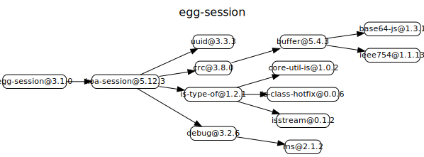

# egg-session

# 源码分析

将koa-session作为中间件挂载，并提供了sessionStore，方便自定义存取器，供给config.session.store。

## 文件结构

``` bash
├── app
|  ├── extend
|  |  └── application.js - 通过set app.sessionStore来将Store挂载到config.session.store上，给koa-session将其作为自定义store处理。
|  └── middleware
|     └── session.js - 直接暴露koa-session，中间件
├── app.js - 监听事件报日志
├── config
|  └── config.default.js - 一些配置参数
```

## 外部模块依赖



koa-session[源码分析](https://github.com/FunnyLiu/session/tree/readsource)

## 逐个文件分析

### app.js

将middleware文件夹下的中间件session.js推入middleware列表中。

### app/extend/application.js

通过set app.sessionStore来将Store挂载到config.session.store上，给koa-session将其作为自定义store处理，koa-session默认是用cookie来存取。

### app/middleware/session.js

直接依赖koa-session模块并对外暴露

## Install

```bash
$ npm i egg-session --save
```

## Usage

egg-session is a built-in plugin in egg and enabled by default.

```js
// {app_root}/config/plugin.js
exports.session = true; // enable by default
```

### External Store

egg-session support external store, you can store your sessions in redis, memcached or other databases.

For example, if you want to store session in redis, you must:

1. Dependent [egg-redis](https://github.com/eggjs/egg-redis)

  ```bash
  npm i --save egg-redis
  ```

2. Import egg-redis as a plugin and set the configuration

  ```js
  // config/plugin.js
  exports.redis = {
    enable: true,
    package: 'egg-redis',
  };
  ```

  ```js
  // config/config.default.js
  exports.redis = {
    // your redis configurations
  };
  ```

3. Implement a session store with redis

  ```js
  // app.js

  module.exports = app => {
    // set redis session store
    // session store must have 3 methods
    // define sessionStore in `app.js` so you can access `app.redis`
    app.sessionStore = {
      async get(key) {
        const res = await app.redis.get(key);
        if (!res) return null;
        return JSON.parse(res);
      },

      async set(key, value, maxAge) {
        // maxAge not present means session cookies
        // we can't exactly know the maxAge and just set an appropriate value like one day
        if (!maxAge) maxAge = 24 * 60 * 60 * 1000;
        value = JSON.stringify(value);
        await app.redis.set(key, value, 'PX', maxAge);
      },

      async destroy(key) {
        await app.redis.del(key);
      },
    };

    // session store can be a session store class
    // app.sessionStore = class Store {
    //   constructor(app) {
    //     this.app = app;
    //   }
    //   async get() {}
    //   async set() {}
    //   async destroy() {}
    // };
  };
  ```

Once you use external session store, session is strong dependent on your external store, you can't access session if your external store is down. **Use external session stores only if necessary, avoid use session as a cache, keep session lean and stored by cookie!**

## Configuration

Support all configurations in [koa-session](https://github.com/koajs/session).

[View the default configurations](https://github.com/eggjs/egg-session/blob/master/config/config.default.js)

## Questions & Suggestions

Please open an issue [here](https://github.com/eggjs/egg/issues).

## License

[MIT](https://github.com/eggjs/egg-session/blob/master/LICENSE)
